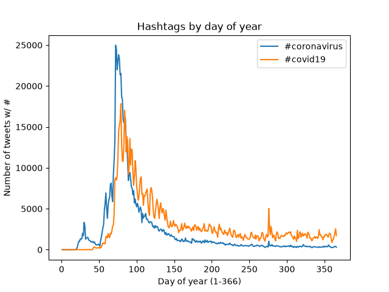

# Using MapReduce to Analyze Twitter Hashtags

In this project I wanted to see where and in what languages people were using coronavirus hashtags throughout 2020. Here, the MapReduce pattern is used to analyze all geotagged tweets from 2020.

From the graphs below you can see that #coronavirus was used predominantly in the English language and in the U.S. You can also see that #코로나바이러스 was used pretty much exclusively in the Korean language and in South Korea.

